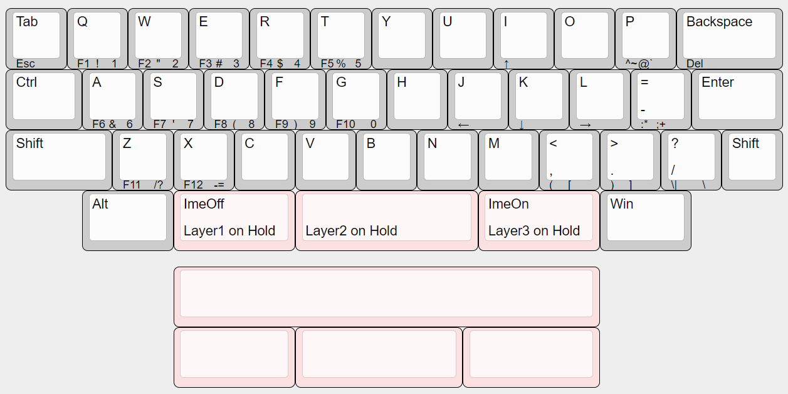

# Henge40

A compact 40% keyboard with 12-column row staggered layout in 12.75u width.

This keyboard was inspired by [Menhir](https://fruitykeeb.xyz/collections/menhir-collection/products/gb-menhir).

## Default Layout

You can also customize the layout using [Vial](https://get.vial.today/).

## Build Guide

See [Build Guide](doc/buildguide.md).

## License

This project is licensed under the MIT License, see the [LICENSE file](LICENSE) for details.

However, this does not apply to logo data (image files, KiCAD footprints, etc.) included in the resources of this project. Please contact us for secondary use.
