# Henge40ビルドガイド

## 1. 本書について

本書は自作キーボードHenge40キットのビルドガイドです。

## 2. 準備

### 2.1 内容物の確認

不足があった場合は本ガイド下部記載のお問い合わせ先までお寄せください。

※販売品に注記がある場合はそちらを正としてください。

|番号|品目|数量|
|---|---|---|
|1|Henge40 スイッチプレート|1枚|
|2|Henge40 メイン基板|1枚|
|3|Henge40 ドーターボード|1枚 (取付済)|
|4|Henge40 ケース (ボトム/トップ)|1セット|
|5|Henge40 スイッチフォーム|1枚|
|6|Henge40 スイッチパッド|1枚|
|7|Henge40 ケースフォーム|1枚|
|8|FPCケーブル 150mm 8ピン 1mmピッチ|1+1(予備)本|
|9|M2ねじ 4mm|8個 (取付済)|
|10|Damping Ball|4個 (取付済)|
|11|ゴム足（小）|4個|
|12|ゴム足（大） ※Standardケースにのみ付属|2個|

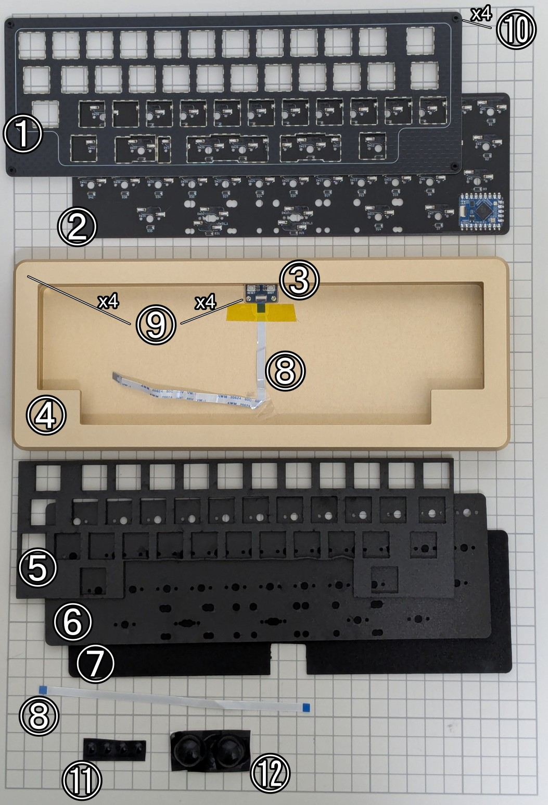

### 2.2 別途用意が必要な部品

下記は本キットに含まれません。国内外の自作キーボード専門店や電子部品販売店などから別途調達してください。

|品目|数量|備考|
|---|---|---|
|MX互換キースイッチ|39-41|[Cherry MX](https://www.cherry.de/en-gb/gaming/developer)もしくはその互換品|
|MX互換キーキャップ|必要数|[Cherry MX](https://www.cherry.de/en-gb/gaming/developer)もしくはその互換品|
|2uサイズPCBマウント型スタビライザー|2-3|幅の広いキーの押し下げを安定させる部品です。最下段で2u/2.75uキーを使う場合に必要です|
|3uサイズPCBマウント型スタビライザー|1|幅の広いキーの押し下げを安定させる部品です。最下段で3uキーを使う場合に必要です|
|7uサイズPCBマウント型スタビライザー|1|幅の広いキーの押し下げを安定させる部品です。最下段で7uキーを使う場合に必要です|

### 2.3 適合するキーキャップサイズ

下図の通りのキーキャップが必要です。赤網掛け部分は入れ替え可能な部分です。

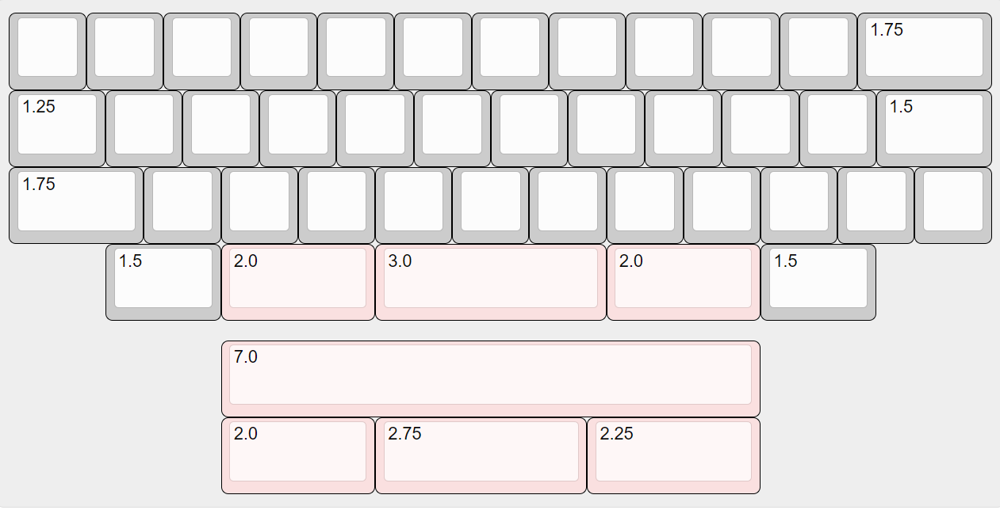

一般的なキーキャップセットには含まれないサイズがありますのでご購入の際はご注意ください。特に下記サイズは標準的なキーキャップセットに加えて別途40%用のキーキャップセットを入手する必要があります。

|行|サイズ|初期レイアウトの対応キー名|
|---|---|---|
|R1| - |※本キーボードにR1行はありません。最上段はR2行となります|
|R2|1u|Tabキー|
|R2|1.75u|Backspaceキー|
|R3|1.25u|Controlキー|
|R3|1.5u|Enterキー|
|R4|1.75u|Shiftキー|
|R4|1u|Shiftキー|
|R4|2u x 2, 2.75u, 3u, 7u|スペースキー|

上に示したキー名はあくまで初期レイアウトのもので、これはお好みに変更可能です。また、キーキャップの印字はただの飾りですので、同じ行の同じサイズのキーキャップであれば異なる印字のキーキャップでもお使いいただけます。

> [!TIP]
> 自分でデザインしたキーキャップセットを購入できるサービス[YUZU Custom Keycaps](https://yuzukeycaps.com/)の40%キットにて、必要なキーが全て揃います。参考までに作者が展示用にデザインした[Henge40 Yozora](https://yuzukeycaps.com/c/3475d350-a4f5-4abe-b16b-a6b00855d77e)テンプレートをカスタマイズして発注するのも良いかと思います。

### 2.3 道具

以下の道具が必要です。

|品目|数量|備考|
|---|---|---|
|ねじ回し（プラス、M2用1番）|1|ケースを固定する際に用います|

## 4. 組み立て

### 4.1 メイン基板の準備

> [!CAUTION]
> まず作業を始める前に、メイン基板のウラ面にあるFPCケーブルコネクタの羽が水平方向に閉じていることを確認します。これが垂直方向に開いた状態で後続の作業を行うと羽が破損する可能性があります。
> 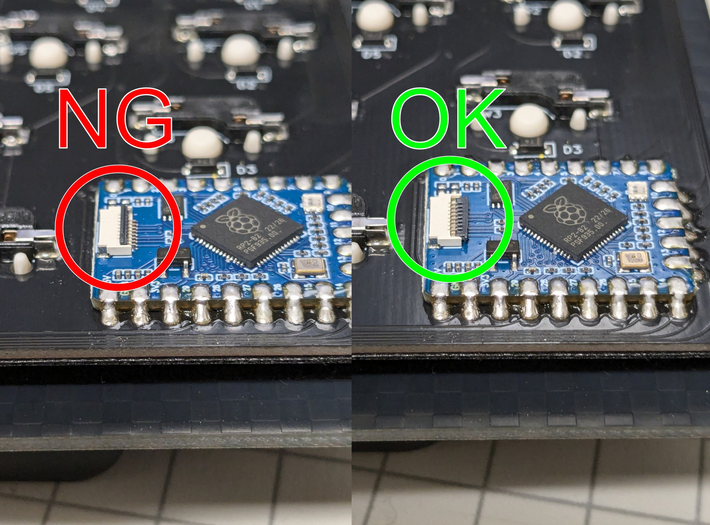

確認出来たら、**オモテ面**が上になるようにメイン基板を作業場所に配置します。

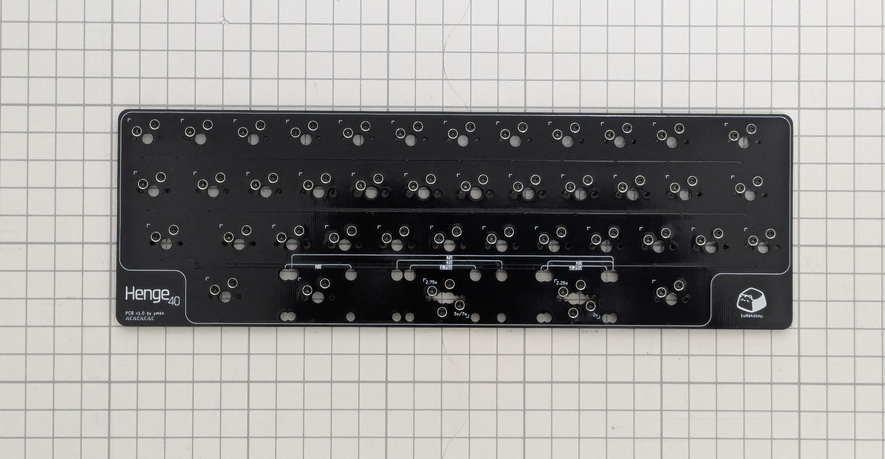

### 4.2 スイッチパッドの取り付け

スイッチパッドを基板の上に設置してください。スイッチパッドと基盤の穴の位置を合わせて単純に乗せるだけでよいです。

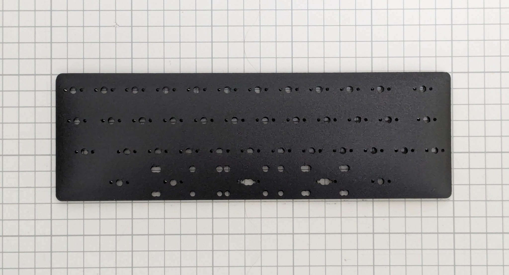

> [!TIP]
> スイッチパッドは打鍵音を低音寄りに変化させるための部品です。取り付けは任意ですが、取り付けない場合は1.2mm厚基板用スタビライザーを用いるか、1.6mm厚基板用スタビライザーにシム（0.4mm）を挟んで高さを調節してください。

### 4.3 スタビライザーの取り付け

スイッチパッドの上からスタビライザーを取り付けます。

取り付け位置はレイアウトによって異なります。メイン基板上のガイドを参照してください。

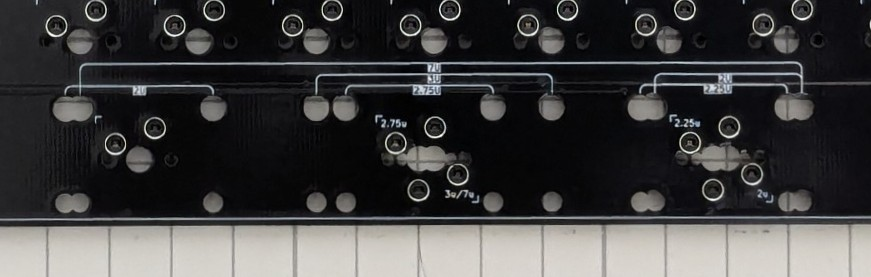

取り付け方はスタビライザーの説明書や世間の情報を参照ください。一般には大きい穴の方にツメを引っかけ、小さい穴の方にプッシュピンを差し込む、もしくはネジ留めを行うものが多いです。

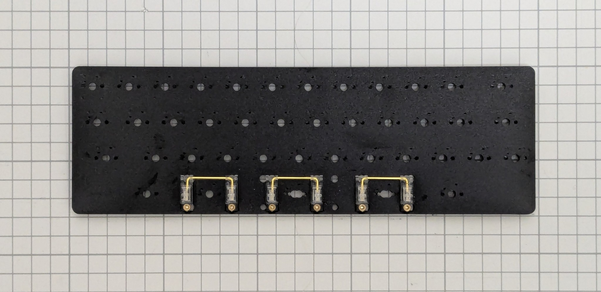

### 4.4 スイッチフォームの取り付け

スイッチパッドの上にスイッチフォームを乗せます。フォームの穴とスイッチの設置箇所が合う向きにしてください。

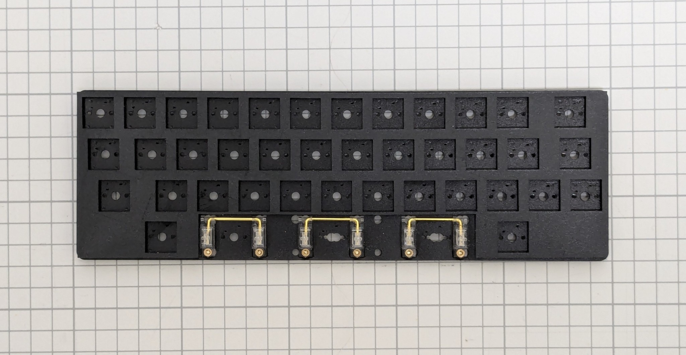

> [!TIP]
> スイッチフォームは打鍵音を小さくし反響音を抑えるための部品です。取り付けは任意です。

### 4.5 スイッチとスイッチプレートの取り付け

スイッチフォームの上にスイッチプレートを乗せ、その上からスイッチを基板のソケットに差し込みます。

差し込む前にスイッチの向きをよく確認してください。ほとんどのスイッチは南向き（ピンがキーボードの奥側向き）ですが、採用レイアウトによっては最下段に北向きの場所があります。誤った向きに押し込んでピンを曲げてしまった場合は、ラジオペンチなどで伸ばしてください。

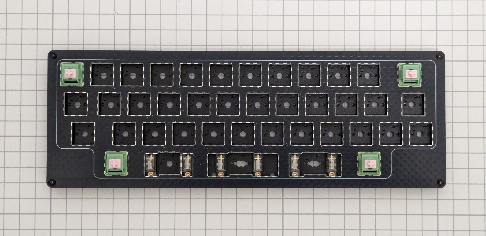

先に四隅に取り付けると作業しやすいです。

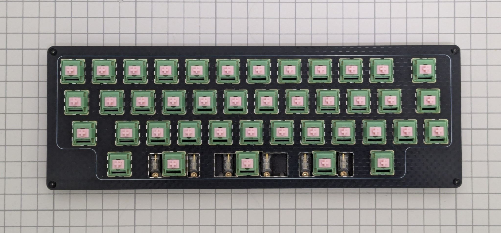

### 4.6 ケースフォームの取り付け

ケース底面四隅のネジをはずして、ケースの蓋を外します。切り欠きの位置を合わせてケースに乗せてください。

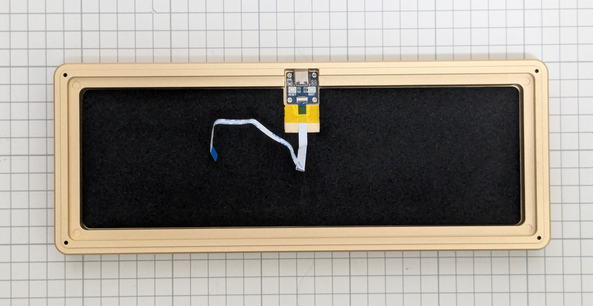

> [!TIP]
> ケースフォームは打鍵音の反響を抑えるほか、万一基盤とケースが触れた場合のショートを防止する役割があります。打鍵音の調整のために取り付けない場合は、代わりに絶縁可能な素材を敷いてください。

### 4.7 メイン基板とドーターボードの接続

メイン基板とドーターボードをFPCケーブルで接続します。

> [!WARNING]
> FPCケーブルを接続する**コネクタは非常に壊れやすい**部分です。無理な力を加えないように注意して作業してください。コネクタを折ってしまった場合はケーブル接続が不可能となり、キーボードとして使用できなくなってしまいます。

FPCコネクタ（黒い羽根）を垂直に立つように跳ね上げます。

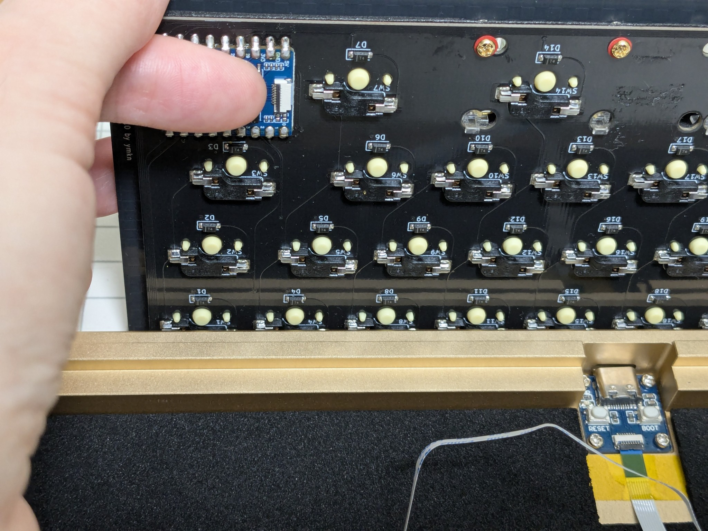

FPCケーブルの青色の面を上にしてコネクタに差し込みます（1mm弱ほどは刺さるはずです）。

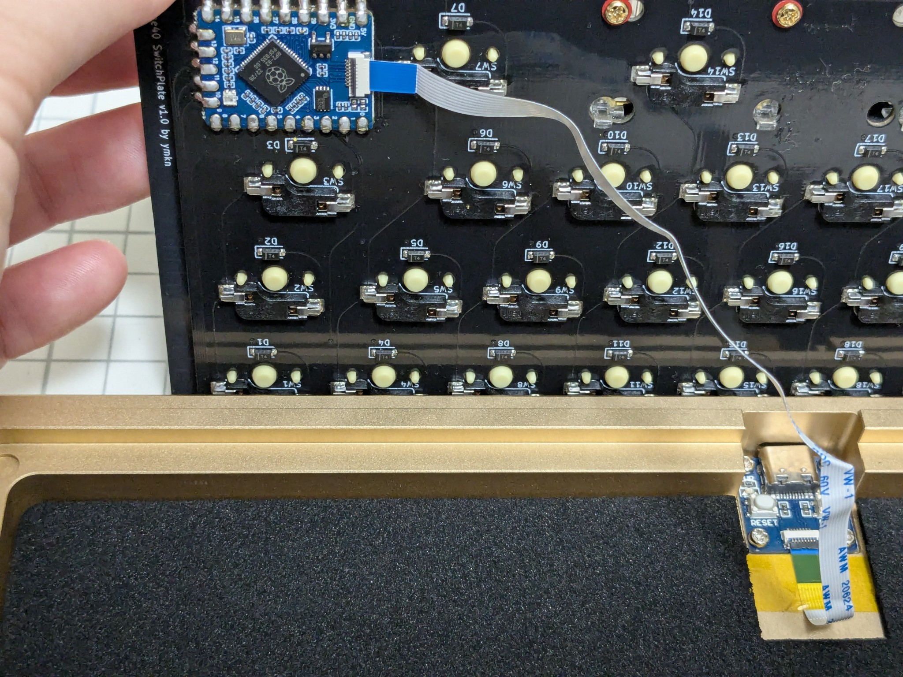

ケーブルがまっすぐに刺さっていることを確認し、コネクタの羽を元に戻して固定します。ケーブルを軽く引っ張って、抜けないことを確認してください。

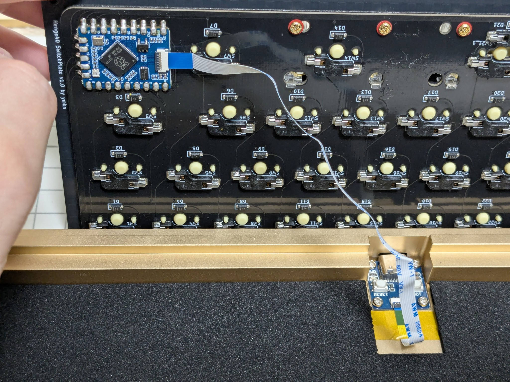

> [!TIP]
> ここでFPCケーブルをメイン基板にテープ等で固定しておくと、打鍵時にケーブルがメイン基板にぶつかってカチャカチャ音が鳴るのを防げます。
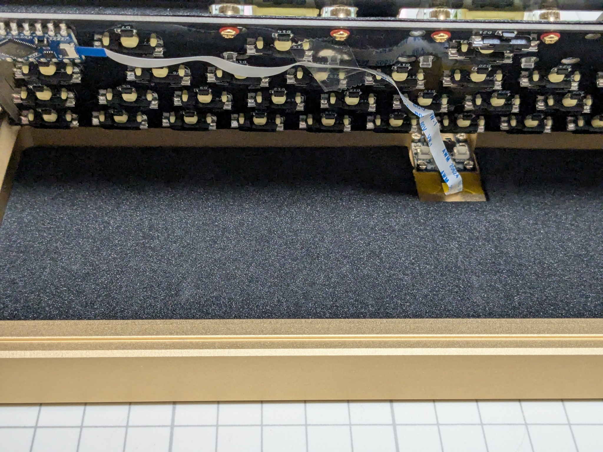

ケーブルが接続できたら、メイン基板をケースの上に置いてください。スイッチプレート四隅のゴム足が、ケースの丸い溝に入るようにします。

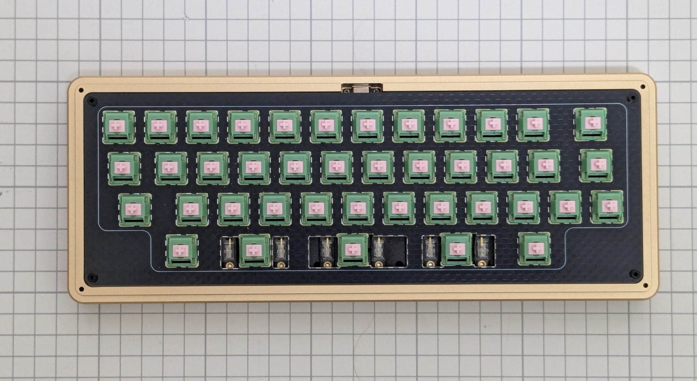

### 4.8 ケースのネジ留め

> [!CAUTION]
> ケースをひっくり返す際にうっかり基板を落下させてしまうと、ケーブルが強く引っ張られてコネクタを破損させてしまう可能性があります。そうならないよう慎重に行ってください。

上蓋と基板が落下しないように支えながらケースをひっくり返し、ケース底部四隅の穴にネジを入れてネジ留めを行ってください。

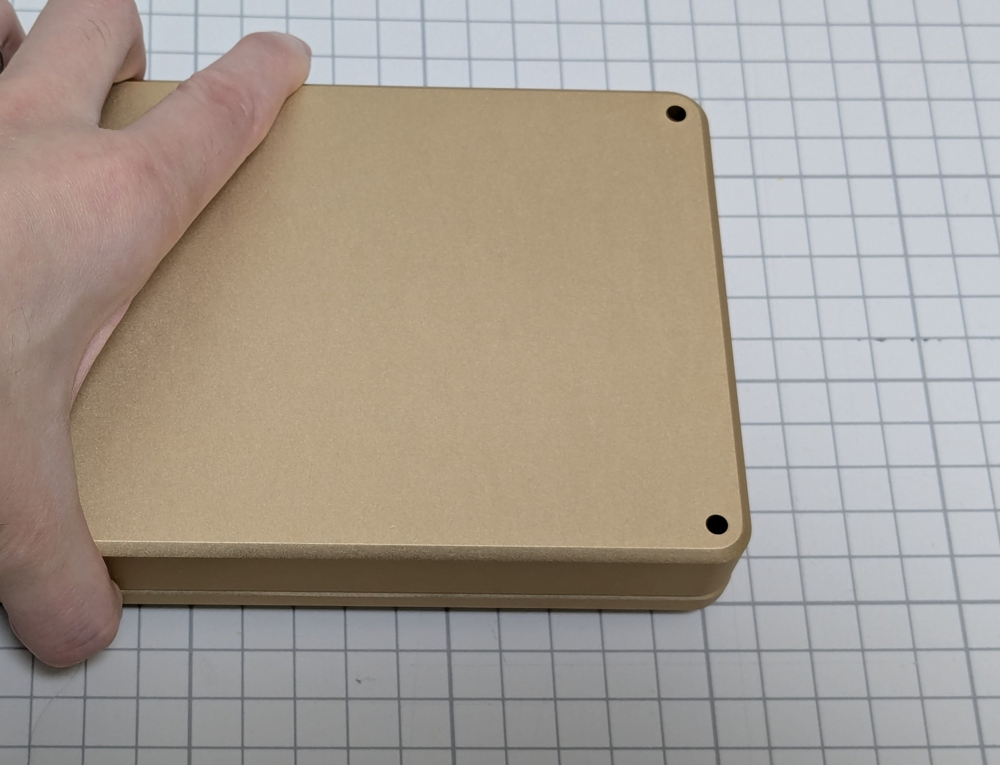

このとき、強い力でネジを締めつけ過ぎないように注意してください。軽い力でネジを回していって、抵抗感が増して動きにくくなるあたりで十分です。

ネジが締まったら、お好みでゴム足を取り付けてください。

### 4.10 キーキャップの取り付け

ケースの向きをもとに戻し、全てのスイッチにキーキャップを取り付けてください。

> [!TIP]
> スタビライザーのあるキーキャップは、深く押し込み過ぎると戻りにくくなることがあります。スイッチのある中央部分だけを押し込んで取り付けるようにするとよいでしょう。

すべて取り付けられたら完成です。

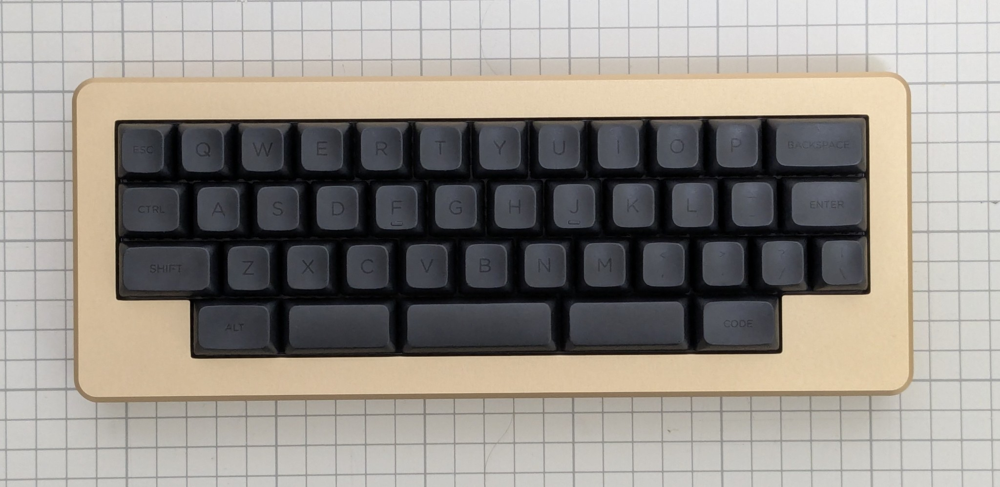

## 5. 使用

### 5.1 動作確認

コンピュータとHenge40をUSBケーブルで接続し、キーボードとして認識され、文字が入力できることを確認してください。

キーボードとして認識されない場合は、FPCケーブルが外れていたりズレていたりする可能性があります。メイン基板側とドーターボード側の両方が適切に接続されていることを確認してください。また、FPCケーブルを何度も強く曲げた場合など断線している可能性があります。そのような場合は予備のケーブルに交換してください。

一部のキーのみ反応しない場合は、そのキースイッチを抜いて、スイッチのピンが曲がっていないか確認してから挿し直してみてください。ピンが曲がっていない場合でも接触が悪いせいで動かないケースもあります。

### 5.2 キーマップのカスタマイズ

本キーボードは[Vial](https://get.vial.today/)というキーマップ変更ツールに対応しています。Vialの詳しい使いかたはVialのドキュメント等を参考にしてください。

> [!TIP]
> 何らかの理由で既定のレイアウトに戻したい場合は、本書末尾記載の「ブートモードの入り方」に従いブートモードに入った後、再度USBケーブルを抜き差しすることで初期化されます。

## 6. その他

### 6.1 ブートモードの入り方

ブートモードに入るには、USBケーブルを切断してから、左上のキー（Tabキー）を押しながらUSBケーブルを接続します。

もしくは、USBケーブルを接続した状態でドーターボード上のBOOTボタンを押しながらRESETボタンを押します。

### 6.2 ソースコード/設計データのありか

本リポジトリ内で公開しています。MITライセンスです。

https://github.com/ymkn/henge40

### 6.3 ファームウェアの書き込み

何らかの理由でファームウェアを書き込み直した場合は下記からファームウェアをダウンロードしてください。

https://github.com/ymkn/henge40/releases/download/v1.0/ymkn_Henge40_vial.uf2

### 6.4 お問い合わせ先

Henge40キットに関わるご質問はご購入されたアカウントにてログイン後、[BOOTHのメッセージ欄](https://ymkn.booth.pm/conversations)までお願いいたします。

キーケット等で直接購入された方でBOOTHのアカウントをお持ちでない場合は、私のTwitterアカウント[@ymkn_gbf](https://x.com/ymkn_gbf)でも受け付けます。メンションもしくはDMをください。

> [!NOTE]
> Henge40キットに直接関わらない一般的な質問（部品の選び方、Vialの使いかた等）はお受けいたしませんので予めご了承ください。
